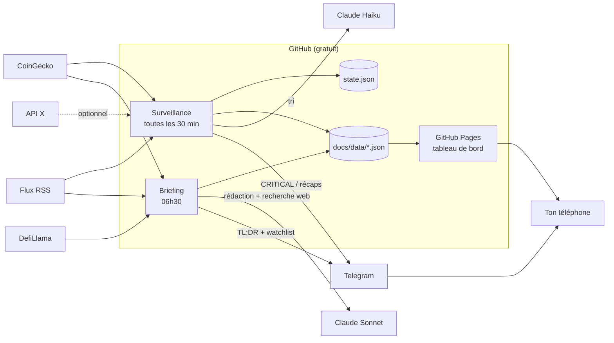

# Crypto Intel — analyse et architecture

Ce document répond aux 15 questions du cahier des charges. Les tarifs sont des estimations de septembre 2026 : vérifie-les sur les pages officielles avant de t'engager.

## 1. Ce que Claude peut faire directement (dans l'app)

- Générer un briefing complet à la demande, avec recherche web, sources et niveaux de confiance.
- Le publier dans ton tableau de bord Crypto Daily sur claude.ai : chaque édition est gardée et consultable par date.
- Ajouter des alertes « Breaking » quand tu écris « Mise à jour ».
- Concevoir, écrire et tester le code du système automatique (ce dossier).

## 2. Ce que Claude ne peut pas faire seul

- Se déclencher tout seul à 06h30 : il ne répond que quand tu lui écris.
- Envoyer une notification push sur ton téléphone.
- Surveiller le marché 24 h/24.
- Lire X en temps réel : il ne voit les tweets qu'à travers la recherche web, avec du retard.

**D'où ce dossier** : un petit programme qui tourne gratuitement sur les serveurs de GitHub, appelle Claude via son API, et t'envoie les alertes sur Telegram.

## 3. Sources de données

| Besoin | Source | Coût |
|---|---|---|
| Prix, variations 1 h / 24 h / 7 j, volumes du top 100 | CoinGecko (clé « Demo ») | Gratuit |
| TVL, frais, stablecoins, volumes DEX | DefiLlama | Gratuit |
| Sentiment (Fear & Greed) | alternative.me | Gratuit |
| Actualités | Flux RSS : CoinDesk, The Block, Decrypt, Blockworks, SEC, Ethereum Foundation, gouvernance Aave… | Gratuit |
| Vérification, unlocks, régulation, nouveaux projets | Recherche web de Claude | ≈ 0,01 $ par recherche |
| Tweets officiels | API X (optionnel) | ≈ 0,005 $ par tweet lu |
| Whales avancé | Arkham, Whale Alert (optionnel, phase 2) | Payant, tarifs à vérifier |

## 4. Récupérer X / Twitter

- **Voie officielle (recommandée)** : l'API X est désormais payante à l'usage, environ 0,005 $ par tweet lu, sans abonnement minimum. On surveille une liste courte de comptes (≈ 18) : officiels des projets, fondateurs, régulateurs, comptes de suivi on-chain.
- **Anti-usurpation** : chaque compte est identifié par son **identifiant numérique**, pas par son pseudo. Un faux compte peut copier un pseudo à une lettre près, jamais l'identifiant. `python -m src.tools resolve-x` récupère les identifiants ; tu vérifies ensuite chaque compte une fois à la main.
- **Sans API X** : le système fonctionne quand même. Claude repère les tweets importants via les médias qui les reprennent, avec un peu de retard.
- **À éviter** : les services de « scraping » bon marché. Ils sont contraires aux conditions d'utilisation de X et peuvent être coupés du jour au lendemain.

## 5. News en temps réel

Toutes les 30 minutes, le programme lit les flux RSS et, si l'API X est activée, les comptes X. Il écarte tout ce qu'il a déjà vu, puis Claude Haiku (le modèle le moins cher) classe chaque nouveauté : 🚨 CRITICAL, 🔔 IMPORTANT ou 📰 NORMAL.

## 6. Données on-chain

DefiLlama fournit la TVL, les frais, les stablecoins et les volumes DEX. CoinGecko fournit les mouvements de prix anormaux, détectés **par le code** et non par l'IA : +5 % en 1 h sur une crypto prioritaire → IMPORTANT, +10 % → CRITICAL. Pour les flux d'exchanges et les whales, la phase 2 pourra brancher Arkham ou Whale Alert.

## 7. Notifications push

**Telegram**, via un bot personnel : c'est gratuit, les notifications natives arrivent sur iPhone et Android, et c'est ton « canal dédié ».
- 🚨 CRITICAL : envoyé immédiatement, jamais plus de 6 par jour.
- 🔔 IMPORTANT : regroupé dans deux récaps silencieux, à 12h30 et 18h30.
- 📰 NORMAL : uniquement dans le briefing de 06h30.
- La nuit (23h00–06h30), seules les CRITICAL passent.

Alternative : ntfy.sh, gratuit, sans compte.

## 8. Briefing automatique de 06h30

GitHub Actions lance le script chaque jour. Comme GitHub fonctionne en heure UTC, deux déclenchements couvrent l'heure d'été et l'heure d'hiver, et le script ne garde que le bon. GitHub peut retarder un déclenchement de quelques minutes aux heures chargées. Pour une heure garantie à la minute, un service gratuit comme cron-job.org peut lancer le workflow (voir le README).

## 9. Architecture

Le tableau de bord est **une seule page HTML** (`docs/index.html`). Elle fonctionne à deux endroits :
- sur GitHub Pages, où elle lit les fichiers JSON mis à jour automatiquement ;
- dans Claude, où elle lit les briefings que Claude publie quand tu les demandes.

## 10. Coût approximatif (par mois)

| Poste | Estimation |
|---|---|
| GitHub (dépôt public, Actions, Pages) | 0 $ |
| Telegram, CoinGecko Demo, DefiLlama | 0 $ |
| Briefing quotidien (Claude Sonnet + ~15 recherches) | ≈ 14–18 $ |
| Surveillance (Claude Haiku, seulement quand il y a du nouveau) | ≈ 5–10 $ |
| **Total sans X** | **≈ 20–30 $** |
| API X (≈ 18 comptes) | + ≈ 10–15 $ |

Fixe une **limite de dépense** dans la console Anthropic (par exemple 40 $/mois) et dans la console X. Tarifs officiels : docs.claude.com (page Pricing) et docs.x.com (page Pricing).

## 11. Technologies

Python 3.12, GitHub Actions (planification), GitHub Pages (hébergement), Telegram Bot API (push), API Claude (Sonnet pour rédiger, Haiku pour trier), HTML/CSS/JS sans framework pour le tableau de bord.

## 12. Sécurité

- **Aucune clé dans le code** : elles sont toutes stockées dans les *Secrets* GitHub, invisibles même dans un dépôt public.
- **Aucun accès à ton argent** : le système ne touche à aucun wallet ni exchange. Ne mets jamais de clé privée ou de phrase de récupération nulle part dans ce projet.
- **Bot Telegram en envoi seul** : il n'écoute aucune commande, personne ne peut le piloter.
- **Protection contre l'injection de prompt** : les titres RSS, tweets et pages web sont transmis à Claude comme « données non fiables ». Il a pour consigne de ne jamais suivre d'instruction qui s'y trouverait.
- **Affichage sûr** : le tableau de bord affiche tout en texte brut (aucun HTML injecté ne s'exécute) et n'accepte que des liens http(s). Les messages Telegram sont échappés. Les tests `tests/test_offline.py` le vérifient.
- **Budget plafonné** : limites de dépense Anthropic et X, plafond de 6 notifications CRITICAL par jour.
- **Dépôt public** : n'importe qui peut lire tes briefings et voir tes cryptos prioritaires, mais pas tes clés. Si ça te gêne, passe le dépôt en privé (voir le README).

## 13. Éviter les fake news et les faux tweets

La confiance est calculée **par le code**, à partir des sources réelles, et non devinée par l'IA :
- 🟢 **Confirmé** : source officielle (régulateur, site ou compte officiel vérifié par son identifiant), ou deux médias reconnus de domaines différents.
- 🟡 **Probable** : un seul média reconnu.
- 🟠 **Non confirmé** : uniquement des sites secondaires ou des agrégateurs.
- 🔴 **Rumeur** : uniquement des réseaux sociaux.

Autres garde-fous :
- Les **communiqués sponsorisés** (openPR, Chainwire, GlobeNewswire…) ne comptent jamais comme preuve.
- Une alerte **CRITICAL non confirmée est rétrogradée** en IMPORTANT, avec la mention « en attente de confirmation ». Elle repasse en CRITICAL dès qu'une deuxième source indépendante arrive.
- Les **prix affichés viennent de CoinGecko**, jamais du modèle.

## 14. Éviter les faux projets crypto

Critères appliqués à chaque projet de la rubrique « Projects to watch » :
- **Équipe** : fondateurs identifiables, avec un historique vérifiable.
- **Investisseurs** : confirmés par l'investisseur lui-même (son annonce ou son portefeuille), pas seulement par le projet.
- **Tokenomics publiée** : offre, allocations, vesting. Une alerte est levée si les investisseurs initiaux détiennent beaucoup de tokens et qu'un unlock approche.
- **Produit réel** : utilisateurs, TVL, revenus, activité des développeurs.
- **Signaux d'alerte** : préventes à « x16 », promesses de rendement, couverture uniquement sponsorisée, équipe anonyme sans historique, pression pour acheter vite.

Chaque projet reçoit un score (🟢 sérieux, 🟡 à surveiller, 🟠 spéculatif, 🔴 risque élevé), avec toujours la raison de s'y intéresser **et** la principale raison d'échouer.

## 15. Interface mobile dark mode

- Une seule page, pensée pour le téléphone : fond noir, texte blanc et gris.
- Couleurs uniquement fonctionnelles : vert = positif ou confirmé, jaune = neutre ou probable, orange = non confirmé, rouge = négatif ou rumeur.
- En haut, le TL;DR se lit en une minute, suivi d'une bande de prix des 6 cryptos prioritaires.
- Un index de sections reste collé en haut de l'écran pendant le défilement.
- Chaque carte montre l'essentiel. Le détail (pourquoi c'est important, court et long terme, sources) s'ouvre d'un tap.
- Les éditions précédentes sont accessibles via un sélecteur de date.
